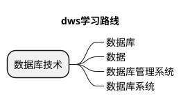
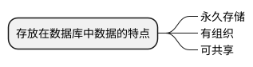
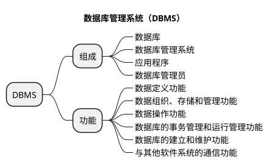

```plantuml
@startmindmap
title dws学习路线
* 数据库技术
**_ 数据库
**_ 数据
**_ 数据库管理系统
**_ 数据库系统
@endmindmap
```

```plantuml
@startmindmap
* 数据
@endmindmap
```

```plantuml
@startmindmap
* 记录
@endmindmap
```

```plantuml
@startmindmap
* 存放在数据库中数据的特点
**_ 永久存储
**_ 有组织
**_ 可共享
@endmindmap
``` 

```plantuml
@startmindmap
title 数据库管理系统（DBMS）
* DBMS
** 组成
***_ 数据库
***_ 数据库管理系统
***_ 应用程序
***_ 数据库管理员
** 功能
***_ 数据定义功能
***_ 数据组织、存储和管理功能
***_ 数据操作功能
***_ 数据库的事务管理和运行管理功能
***_ 数据库的建立和维护功能
***_ 与其他软件系统的通信功能
@endmindmap
```