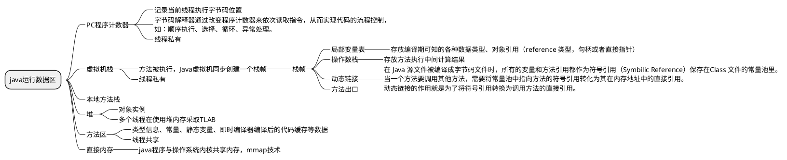
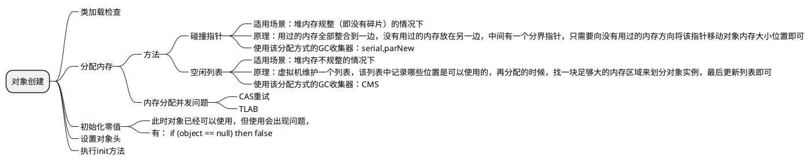
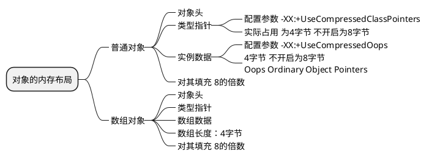
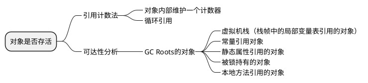
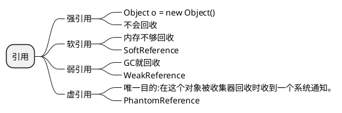
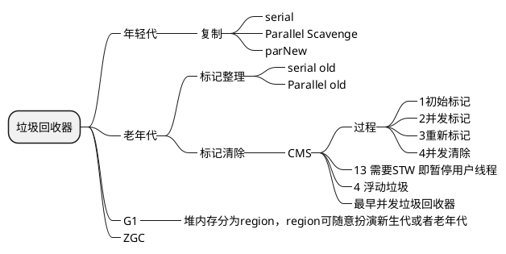
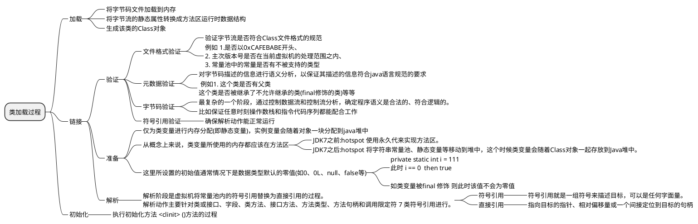
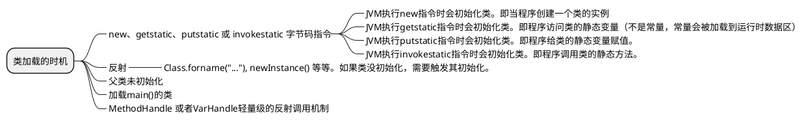

#### 双亲委派

```java
public class ClassLoaderDemo {
    public static void main(String[] args) {
        System.out.println("ClassLodarDemo's ClassLoader is " + ClassLoaderDemo.class.getClassLoader());
        System.out.println("The Parent of ClassLodarDemo's ClassLoader is " + ClassLoaderDemo.class.getClassLoader().getParent());
        System.out.println("The GrandParent of ClassLodarDemo's ClassLoader is " + ClassLoaderDemo.class.getClassLoader().getParent().getParent());
    }
}
```
output

```text
ClassLodarDemo's ClassLoader is sun.misc.Launcher$AppClassLoader@18b4aac2
The Parent of ClassLodarDemo's ClassLoader is sun.misc.Launcher$ExtClassLoader@1b6d3586
The GrandParent of ClassLodarDemo's ClassLoader is null
```

```java
private final ClassLoader parent;
protected Class<?> loadClass(String name, boolean resolve)
        throws ClassNotFoundException
    {
        synchronized (getClassLoadingLock(name)) {
            // 首先，检查请求的类是否已经被加载过
            Class<?> c = findLoadedClass(name);
            if (c == null) {
                long t0 = System.nanoTime();
                try {
                    if (parent != null) {//父加载器不为空，调用父加载器loadClass()方法处理
                        c = parent.loadClass(name, false);
                    } else {//父加载器为空，使用启动类加载器 BootstrapClassLoader 加载
                        c = findBootstrapClassOrNull(name);
                    }
                } catch (ClassNotFoundException e) {
                   //抛出异常说明父类加载器无法完成加载请求
                }

                if (c == null) {
                    long t1 = System.nanoTime();
                    //自己尝试加载
                    c = findClass(name);

                    // this is the defining class loader; record the stats
                    sun.misc.PerfCounter.getParentDelegationTime().addTime(t1 - t0);
                    sun.misc.PerfCounter.getFindClassTime().addElapsedTimeFrom(t1);
                    sun.misc.PerfCounter.getFindClasses().increment();
                }
            }
            if (resolve) {
                resolveClass(c);
            }
            return c;
        }
    }

```

过程：findInCache -> parent.loadClass -> findClass()
好处：保证了 Java 程序的稳定运行，可以避免类的重复加载

打破双亲委派
重写loadClass()即可


### 参考
- 《深入理解 Java 虚拟机：JVM 高级特性与最佳实践（第三版》
- [https://javaguide.cn/java/jvm/memory-area.html](https://javaguide.cn/java/jvm/memory-area.html)
