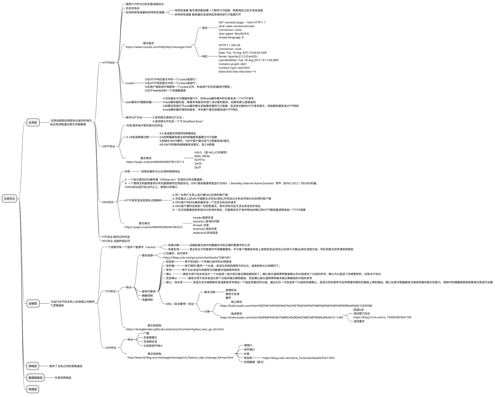

```puml
@startmindmap
* 五层协议
** 应用层 
***_: 应用进程和应用层协议留存的地方
各应用进程通过报文传输数据;
****_ HTTP协议 
*****_ 使用TCP作为它的支撑运输协议
*****_ 无状态协议
*****_ 支持持续性连接和非持续性连接
******_ 持续性连接 每次请求都创建一个新的TCP连接，获取响应之后关闭该连接
******_ 非持续性连接 服务器在发送响应后保持该TCP连接打开
*****_: 
                        报文格式
https://www.runoob.com/http/http-messages.html
;

******_ 请求 
*******_: 
GET /somedir/page ・html HTTP/1.1    
Host: www someschool.edu
Connection: close
User-agent: Mozilla/5•0
Accept-language: fr;

******_ 响应 
*******_: 
HTTP/1.1 200 OK
Connection: close
Date: Tue, 18 Aug 2015 15:44:04 GMT
Server: Apache/2.2.3 (CentOS)
Last-Modified: Tuer 18 Aug 2015 15:11:03 GMT
Content-Length: 6821
Content-Type: text/html
(data data data data data •••);

*****_ cookie
******_: 
①在HTTP响应报文中的一个cookie首部行；
②在HTTP请求报文中的一个cookie首部行；
③在用户端系统中保留有一个cookie文件，并由用户的浏览器进行管理；
④位于Web站点的一个后端数据库;

*****_ web缓存(代理服务器)
******_: 
①浏览器先与代理服务器TCP，并向web缓存器中的对象发送一个HTTP请求
②web缓存器检查，看看本地是否存储了该对象的副本，如果有那么直接返回
③如果没有就打开web缓存器与初始服务器的TCP连接，发送该对象的HTTP请求报文，初始服务器发送HTTP响应
④web缓存器存储响应副本，并向客户端浏览器发送HTTP响应;

*****_ 条件GET方法
******_: 
①请求报文使用GET方法；
②请求报文中包含一个“If Modified-Since”;

****_ SMTP协议 
*****_ 作用 提供电子邮件报文的传送

*****_ A->B发送邮箱过程
******_:
①A 发送报文和提供B邮箱地址
②A的邮箱服务器与B的邮箱服务器建立TCP连接
③初始化SMTP握手，SMTP客户通过该TCP连接发送A报文
④B SMTP的服务器端接收该报文，放入B邮箱;
*****_:                
                    报文格式
https://juejin.cn/post/6844904065785135112;
******_:
HELO （是 HELLO 的缩写）
MAIL FROM 
RCPTTO
DATA
QUIT;

****_ DNS协议 
*****_ 作用 
******_ 将域名解析为32比特的网络地址

*****_: 
① 一个由分层的DNS服务器（DNSserver）实现的分布式数据库；
② 一个使得主机能够查询分布式数据库的应用层协议。DNS 服务器通常是运行 BIND （ Berkeley Internet Name Domain）软件［BIND 2012 ］的UNIX机器。
③DNS协议运行在UDP之上，使用53号端口;
*****_ HTTP请求发送至域名过程解析
******_:
① 同一台用户主机上运行着DNS应用的客户端
② 浏览器从上述URL中抽取岀主机名(域名),并将这台主机名传给DNS应用的客户端
③ DNS客户向DNS服务器发送一个包含主机名的请求
④ DNS客户最终会收到一份回答报文，其中含有对应于该主机名的IP地址
⑤ 一旦浏览器接收到来自DNS的该IP地址，它能够向位于该IP地址80端口的HTTP服务器进程发起一个TCP连接;
*****_: 
                    报文格式
https://juejin.cn/post/6844903582441963527;

******_: 
header首部区域
Question 查询的问题
Answer 应答
Authority 授权应答
Additional 附加信息;

****_ FTP协议 提供文件传送
****_ RFC协议 远程终端访问

** 运输层 
***_: 为运行在不同主机上的进程之间提供
了逻辑通信;
****_ 一个进程可有一个或多个套接字（socket）
*****_ 多路分解
******_ 运输层报文段中的数据交付到正确的套接字的工作
*****_ 多路复用
******_ 源主机从不同套接字中收集数据块，并为每个数据块封装上首部信息(这将在以后用于分解)从而生成报文段，然后将报文段传递到网络层
****_ TCP协议
*****_ 特点
******_ 面向连接
*******_ 三次握手，四次挥手
*******_ https://blog.csdn.net/qzcsu/article/details/72861891
******_ 提供可靠性
*******_ 校验和
********_ 用于检测在一个传输分组中的比特错误
*******_ 定时器
********_ 用于超时/重传一个分组，发送方未收到接受方的ACK，或者收到ACK但超时了。
*******_ 序号
********_ 用于为从发送方到接受方的数据分组按顺序排序
*******_ 确认 
********_ 接收方用于告诉发送方一个分组或一组分组已被正确地接收到了。确认报文通常携带着被确认的分组或多个分组的序号。确认可以是逐个的或累积的，这取决于协议
*******_ 否定确认 
********_ 接收方用于告诉发送方某个分组未被正确地接收。否定确认报文通常携带着未被正确接收的分组的序号
*******_ 窗口、流水线
********_ 发送方也许被限制仅发送那些序号落在一个指定范围内的分组。通过允许一次发送多个分组但未被确认，发送方的利用率可在停等操作模式的基础上得到增加。窗口长度可根据接收方接收和缓存报文的能力、网络中的拥塞程度或两者情况来进行设置

*******_ ARQ（自动重传）协议

********_ 基本功能
*********_: 
差错检验
接受方反馈
重传;
********_ 分类
*********_:               停止等待
https://baike.baidu.com/item/%E5%81%9C%E6%AD%A2%E7%AD%89%E5%BE%85%E5%8D%8F%E8%AE%AE/10290586;
*********_:               连续等待
https://baike.baidu.com/item/%E8%BF%9E%E7%BB%ADARQ%E5%8D%8F%E8%AE%AE/3111685;
**********_:回退N步
滑动窗口协议
https://blog.51cto.com/u_15060546/2641182;
**********_ 选择重传


******_ 拥塞控制
******_ 流量控制
*****_:                              报文段结构
https://zhangbinalan.gitbooks.io/protocol/content/tcpbao_wen_ge_shi.html;
****_ UDP协议 
*****_ 特点
******_ 广播
******_ 无连接建立
******_ 无连接状态
******_ 分组首部开销小
*****_: 
                            报文段结构
http://www.023wg.com/message/message/cd_feature_udp_message_format.html;

******_ 源端口
******_ 目的端口
******_ 长度
******_ 校验和
*******_ https://blog.csdn.net/stone_Yu/article/details/81611067;

******_ 应用数据（报文）
** 网络层
***_ 提供了主机之间的逻辑通信
** 数据链路层
***_ 负责将网络层
** 物理层
@endmindmap

```

#### 应用层协议
应用层协议定义了不同端系统之间，应用进程如何相互传递报文

1. 交换报文类型，请求报文，响应报文。
2. 各种报文类型的语法，如报文中各个字段的描述。
3. 字段的语义，字段中的信息
4. 确定一个进程何时以及如何发送报文，对报文的响应规则。