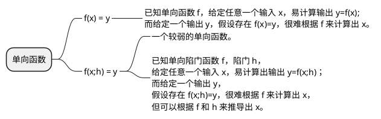
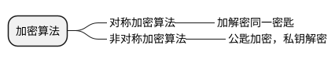
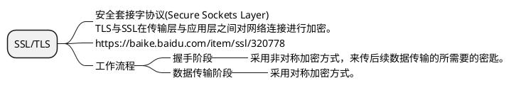
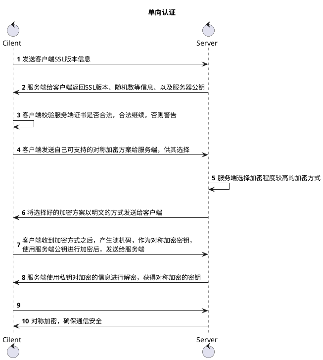
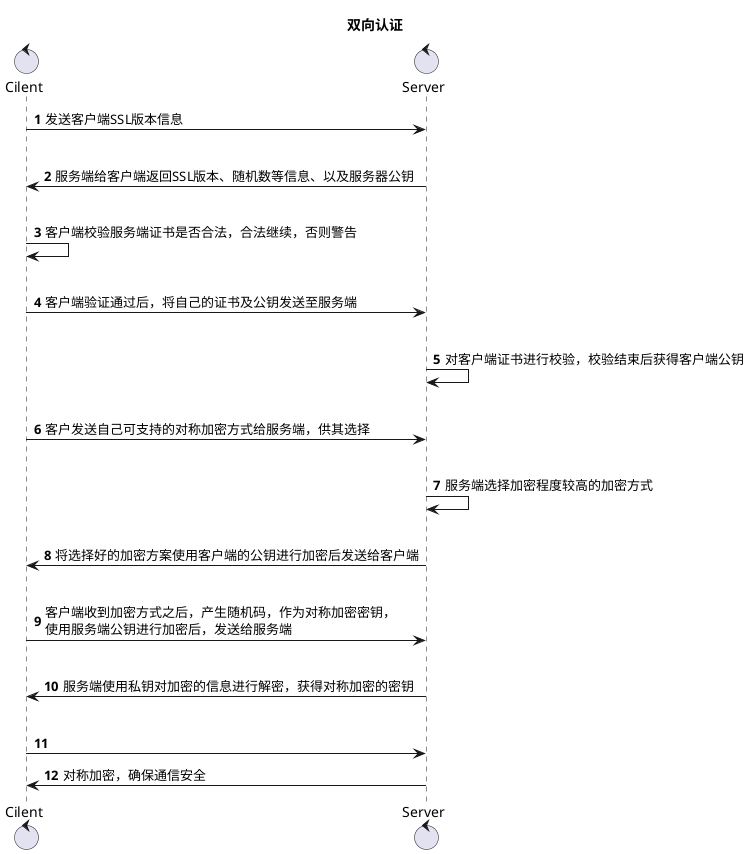

#### 总结

1. 客户端提供ssl版本，获得证书公钥
2. 校验证书
3. 协商对称加密方式
4. 使用非对称算法，获得对称加密的密钥

#### 参考
- https://baike.baidu.com/item/%E5%8D%95%E5%90%91%E9%99%B7%E9%97%A8%E5%87%BD%E6%95%B0/3869579
- 《图解HTTP》
- https://blog.csdn.net/duanbokan/article/details/50847612
