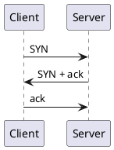
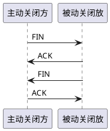

<!-- 三次握手uml图 -->
##### 三次握手

第一次握手：
Client 什么都不能确认；
Server 确认了对方发送正常，自己接收正常
第二次握手：
Client 确认了：自己发送、接收正常，对方发送、接收正常；
Server 确认了：对方发送正常，自己接收正常
第三次握手：
Client 确认了：自己发送、接收正常，对方发送、接收正常；
Server 确认了：自己发送、接收正常，对方发送、接收正常

总结：保证双方发收消息正常。

##### 四次挥手

1.客户端-发送一个 FIN，用来关闭客户端到服务器的数据传送

2.服务器-收到这个 FIN，它发回一 个 ACK，确认序号为收到的序号加 1 。
和 SYN 一样，一个 FIN 将占用一个序号

3.服务器-关闭与客户端的连接，发送一个 FIN 给客户端

4.客户端-发回 ACK 报文确认，并将确认序号设置为收到序号加 1

任何一方都可以在数据传送结束后发出连接释放的通知，待对方确认后进入半关闭状态。
当另一方也没有数据再发送的时候，则发出连接释放通知，对方确认后就完全关闭了 TCP 连接。