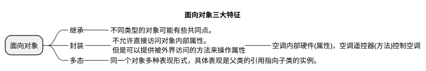
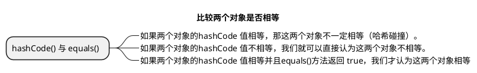
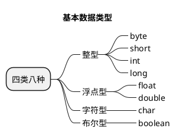
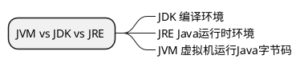
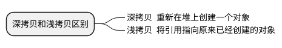

#### 字符串常量和字符型常量区别

|  | 形式上 | 内存占用 | 含义 |
|--|--|--|--|
| 字符串 | 双引号 | 若干字节 | 代表内存地址 |
| 字符型 | 单引号 | 2个字节 | 相当于一个整型(ASCII码)可参与表达式计算 |

#### 重载和重写区别

|  | 发生位置 | 发生时期 | 作用 |
|--|--|--|--|
| 重载 | 同一个类中 | 编译时期 | 重载就是同一个类中多个同名的方法根据不同的传参来处理不同的执行逻辑 | 
| 重写 | 子类-父类 | 运行时期 | 重写就是子类对父类的方法进行重新改造，外部的样子不能改变，内部的逻辑可以改变 |

#### continue、break和return区别

|  | 作用 |
|--|--|
| continue | 停止当前循环 |
| break | 跳出循环 |
| return | 结束方法 |

#### ==和equels区别

|  | == | equels | equels(重写Object) |
|--|--|--|--|
| 基础数据类型 | 值是否相等 | × | × |
| 引用类型 | 对象内存地址是否相等 | 类似== | 对象值是否相等 |

#### 基本数据类型默认值和空间占用

| 基本类型 | 位 | 字节 | 默认值 |取值范围 |
|--|--|--|--|--|
|byte| 8 | 1 | 0 | 2^-8 ~ 2^8 -1 |
|short| 16 | 2 | 0 | 2^-16 ~ 2^16 -1 |
|int| 32 | 4 | 0 | 2^-32 ~ 2^32 -1 |
|long| 64 | 8 | 0L | 2^-64 ~ 2^64 -1 |
|char| 16 | 2 | 'u0000' | 0-65535 |
|float| 32 | 4 | 0f | 1.4E-45 ~ 3.4028235E38 |
|double| 64 | 8 | 0d | 4.9E-324 ~ 1.7976931348623157E308 |
|boolean| 1 |  | false | ture、false |

#### String StringBuffer 和 StringBuilder 的区别是什么?

|  | 可变性 | 线程安全性 | 使用 |
|--|--|--|--|
| String | × | √ | 少量数据 |
| StringBuilder | √ | × | 字符串大量数据(单线程) |
| StringBuffer | √ | √ | 字符串大量数据(多线程) |

String 的不可变性   底层是final修饰的数组，且没有公开对数组的修改
String  str = "a";      
字符串常量池中直接构建对象 
String  str = new String("a");     堆上一个，常量池一个
String.intern();      放到常量池

#### 接口和抽象类有什么共同点和区别？

##### 共同点

- 都不能实例化
- 都可以包含抽象方法
- 可以有默认(default)实现的方法

##### 区别

- 接口是对行为的一种抽象，抽象类是强调所属关系，主要用于代码复用。
- 接口中属性都是常量，抽象类属性不做要求
- 单继承，多实现

#### 什么是泛型

比如List list=new ArrayList();
默认是Object ,放进去的对象，取出来要强转才能使用。
编译时期指定类型，只能放该类型对象，否则编译不通过。

#### Serializable，Cloneable
标记接口
序列化 将对象的状态写入一个字节流，然后可以通过网络传输这些字节，或者写入文件
可克隆 复制一个对象

#### jdk动态代理和cglib动态代理区别
jdk只能代理实现接口的类。

cglib动态代理不受限制。

#### spi 和 api
调用方->接口->实现方
区别调用的接口，由调用方提供还是由实现方提供
API 接口由实现方提供
SPI 接口由调用方提供

SPI 具体实现，ServiceLoader 去加载 jar 中的META-INF/services 类

