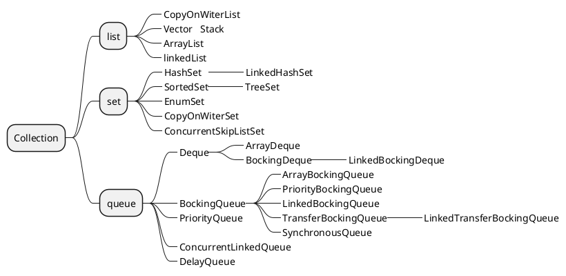
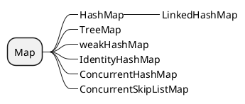

#### ArrayList 和 LinkedList 区别

|  | 数据结构 | 线程安全性 | 插入和删除是否受元素位置的影响 |  快速随机访问 | 内存占用|
|--|--|--|--|--|--|
| ArrayList | 数组 | × | 增删需要移动位置 | 支持 | 尾部预留空间 |
| LinkedList | 双端链表 | × | 解开节点前驱后继就行了，增删快 | 不支持，需要挨个查找 | 每个节点都有前驱和后继 |

#### HashMap
##### 工作原理
HashMap 基于哈希表实现，通过key的hashcode来计算存储位置，当发生hash冲突时，使用链表/红黑树来解决hash冲突。

##### Hash 冲突解决方法
1. 链地址法
2. 开发地址法
- 线性探测 ：index+1，index+2 ...
- 平方探测 ：index+1^2,index+2^2 ...
- 双重hash ：使用第二个hash函数

##### HashMap 容量为啥是2的幂
1. 计算索引时使用 (n-1) & hash替代 hash % n，位运算效率更高
2. 保证 (n-1) 的二进制全是 1，使散列更均匀
3. 扩容时重新计算位置更高效

##### HashMap 的初始容量和负载因子是多少
默认初始容量是16，负载因子是0.75，当元素个数达到容量*0.75，会进行扩容

##### HashMap 的 put 方法执行过程
1. 计算 key 的 hash 值（(h = key.hashCode()) ^ (h >>> 16)）
2. 如果数组为空，进行初始化扩容
3. 计算桶位置 i = (n-1) & hash
4. 如果桶为空，直接插入新节点
5. 如果桶不为空：
   a. 如果第一个节点 key 相同，直接覆盖
   b. 如果是树节点，调用红黑树的插入方法
   c. 如果是链表，遍历查找，找到则覆盖，否则尾插
6. 如果链表长度 ≥ 8，转换为红黑树
7. 如果 size > threshold，进行扩容

##### HashMap 的扩容机制是怎样的？
扩容时创建新数组，大小为原数组的两倍，重新计算每个元素位置
- JDK 1.7 头插法，可能导致死循环
- JDK 1.8 尾插法，优化了重新哈希的过程，原位置或原位置加旧容量

##### HashMap 为什么线程不安全？
1. JDK 1.7 多线程扩容可能导致死循环
2. 数据覆盖：多线程put时可能覆盖值

#### ConcurrentHashMap

1.7 分段锁，锁数量在初始化确定，锁继承ReentrantLock 重入锁
1.8 cas+synchronized 锁node

#### CopyOnWriteArrayList

写时复制，写数据加锁

读取只读取一个快照。
即多个线程同时读取，可能读取到的数据不一致。但是保证最终一致性

读多写少的场景。

