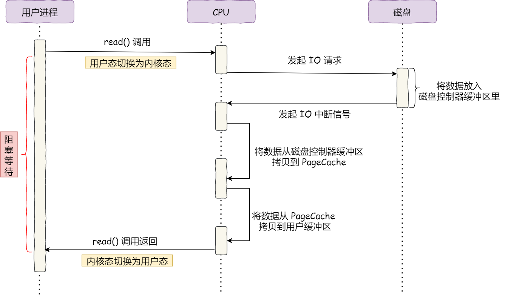
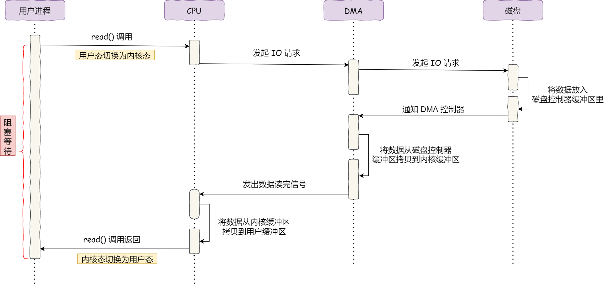
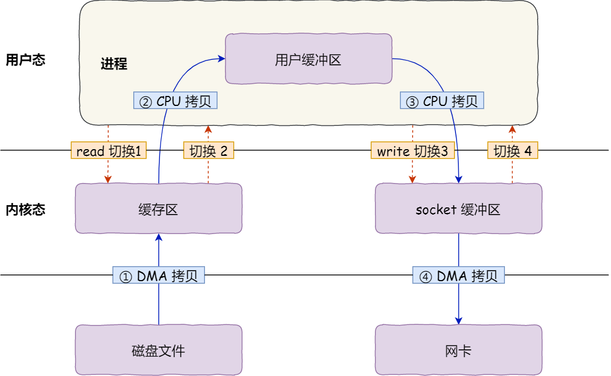
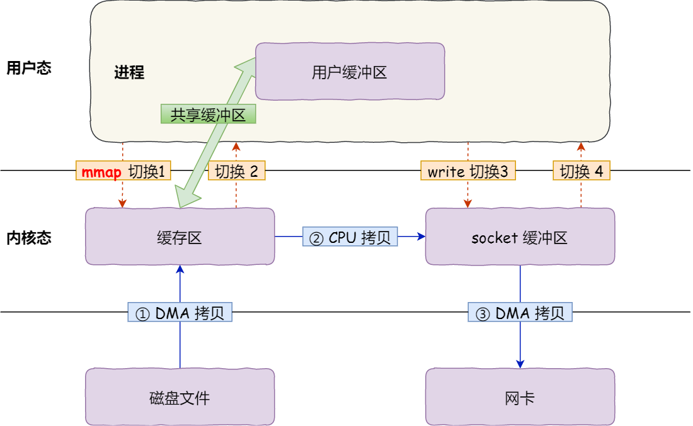
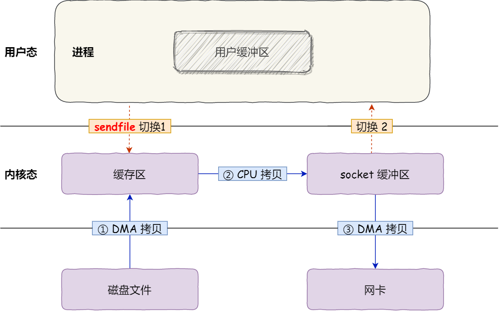
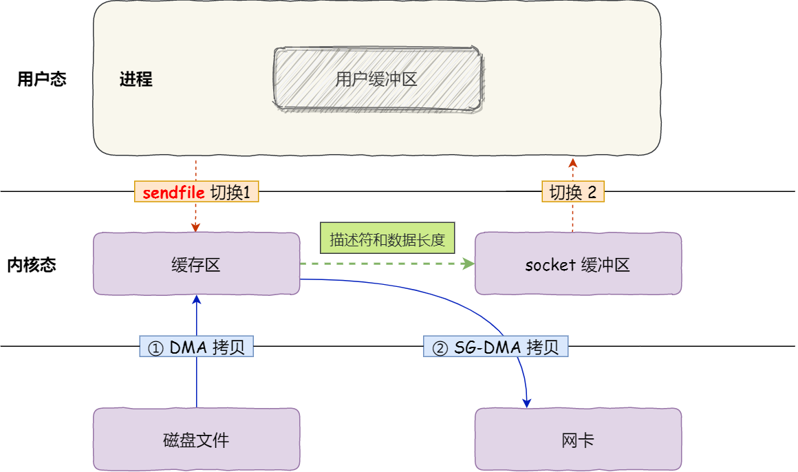
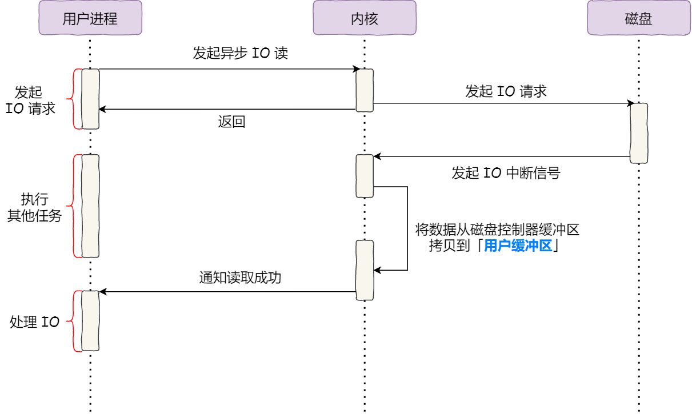

#### 传统io

#### DMA引入

#### 传统的文件传输

#### mmap内存地址映射

#### sendfile

#### 零拷贝

sendfile + 网卡支持SG-DMA

#### 大文件传输

每次优化都减少了上下文切换和数据拷贝次数。

#### 参考
[https://www.cnblogs.com/xiaolincoding/p/13719610.html](https://www.cnblogs.com/xiaolincoding/p/13719610.html)
