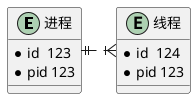
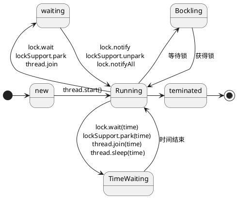
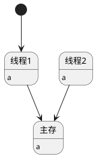
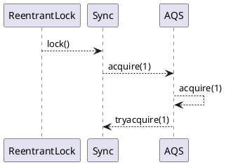
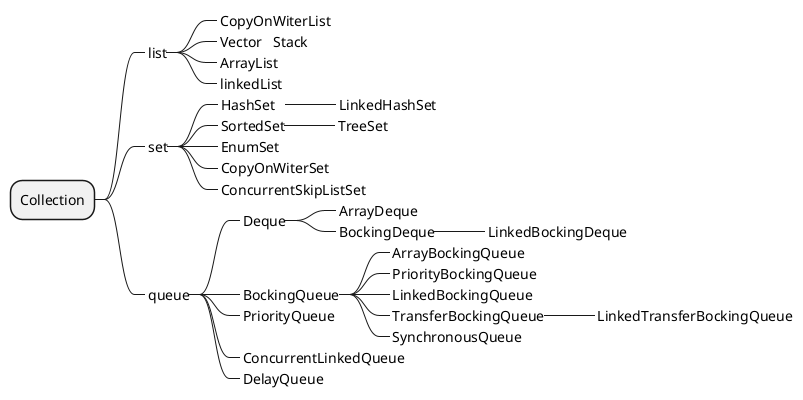
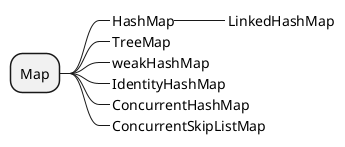
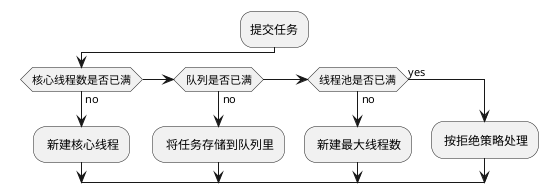

#### 进程线程

1. 进程操作系统调度最小单元
2. 线程CPU调度最小单元



#### 并发并行

1. 并发：任务交替执行
2. 并行：多个CPU一起执行任务 

#### java线程生命周期



#### volatile

1. 保证线程可见性
- MESI
- 缓存一致性协议
2. 禁止指令重排序
- Loadfence指令原语
- Storefence指令原语

任一cpu修改a之后，都会将a写入主存，然后另外cpu缓存的值失效.



#### 锁
JVM synchronized    对象头的markword     00 01 10 11    锁方法    字节码为moniterentry    moniterexit   可重入   独占

java 代码实现   ReentrantLock    公平    非公平      AQS   同步框架实现
手动加锁解锁          
响应中断
尝试超时获取锁
condition   通过condition控制线程等待唤醒  




#### cas
比较交换，CPU原语实现
ABA   version

#### 容器





#### AQS


#### ThreadLocal


#### 1A2B3C

```java
public class waitNotify{
    public static void main(String[] arg){
        String nums="123";
        String strs="abc";
        char[] numsArg=nums.toCharArray();
        char[] strsArg=strs.toCharArray();
        Object lock=new Object();
        new Thread(()->{
            synchronized (lock){
                for(int i =0;i<numsArg.length;i++){
                    system.out.println(numsArg[i]);
                    lock.notify();
                    lock.wait();
                }
                lock.notify();
            }

        }).start();

        new Thread(()->{
            synchronized (lock){
                for(int i =0;i<numsArg.length;i++){
                    system.out.println(numsArg[i]);
                    lock.notify();
                    lock.wait();
                }
                lock.notify();
            }

        }).start();
    } 
}
```

#### 生产者消费者模型
```java
public class ConsumerAndProduct {
    private static BlockingQueue<String> queue=new ArrayBlockingQueue<>(10);

    public static void main(String[] args) {
        Thread consumer = new Thread(()->{
            try {
                while (true){
                    System.out.println(queue.take());
                }
            } catch (InterruptedException e) {
                e.printStackTrace();
            }
        });

        Thread product = new Thread(()->{
            try {
                while (true){
                    queue.put("123");
                }
            } catch (InterruptedException e) {
                e.printStackTrace();
            }
        });
        consumer.start();
        product.start();
    }
}
```

#### 线程池
```java
public ThreadPoolExecutor(int corePoolSize,
                          int maximumPoolSize,
                          long keepAliveTime,
                          TimeUnit unit,
                          BlockingQueue<Runnable> workQueue,
                          ThreadFactory threadFactory,
                          RejectedExecutionHandler handler) {
                    //          
}
```

工作流程



