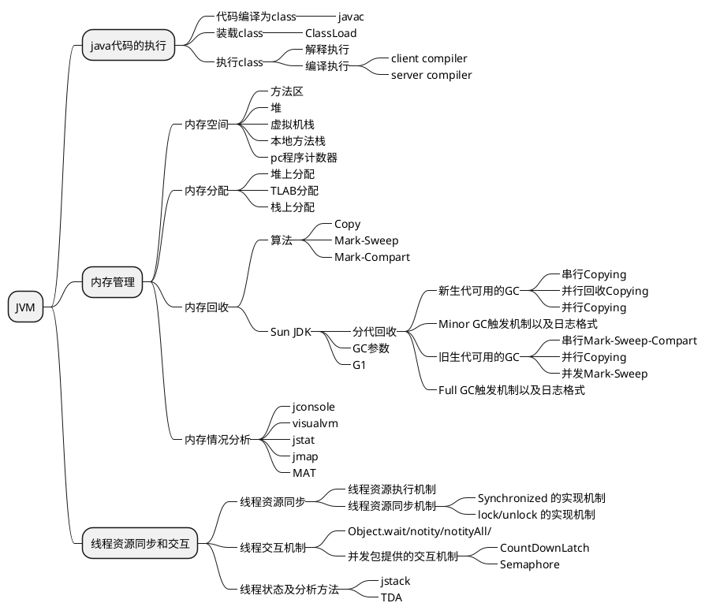

#### JVM
1. 基本概念
JVM是可运行java代码的假想计算机，包括一套字节码指令集、一组寄存器、一个栈、一个垃圾回收堆和一个存储方法域。JVM是运行在操作系统之上的，它与硬件没有直接的交互。
2. 运行过程
2）Java源文件——>编译器——>字节码
3）字节码——>JVM——>机器码

#### 运行时数据区（JMM内存分区）
分为两类，线程共享，线程私有
1. 线程共享
- 堆
- 字符串常量池
- 直接内存
2. 线程私有
- 程序计数器
记录线程的执行位置
- 虚拟机栈
存放栈帧（其实就是方法），参数，方法返回地址
- 本地方法栈
JNI 的方法

#### 对象的创建
1. 类加载检查
2. 分配内存
3. 初始化零值
4. 设置对象头
5. 执行init方法

#### 对象的内存布局
对象头，实例数据，对齐填充

##### 对象头
标记字段：hashcode，对象年龄，锁状态。。。\
类型指针：具体是哪个类的实例

