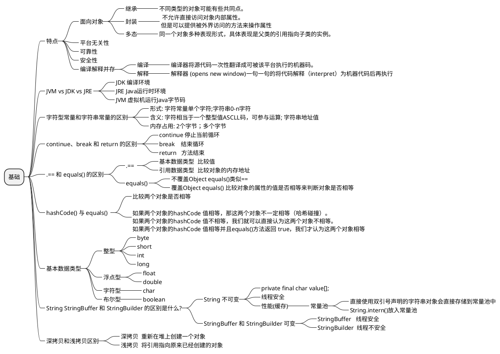

```puml
@startmindmap

* 基础
**_ 特点
***_ 面向对象
****_ 继承
*****_ 不同类型的对象可能有些共同点。
****_ 封装 
*****_: 不允许直接访问对象内部属性。
但是可以提供被外界访问的方法来操作属性;
****_ 多态
*****_ 同一个对象多种表现形式，具体表现是父类的引用指向子类的实例。

***_ 平台无关性
***_ 可靠性 
***_ 安全性 
***_ 编译解释并存
****_ 编译
*****_ 编译器将源代码一次性翻译成可被该平台执行的机器码。
****_ 解释
*****_ 解释器 (opens new window)一句一句的将代码解释（interpret）为机器代码后再执行
**_ JVM vs JDK vs JRE 
***_ JDK 编译环境
***_ JRE Java运行时环境
***_ JVM 虚拟机运行Java字节码
**_ 字符型常量和字符串常量的区别
***_ 形式: 字符常量单个字符;字符串0-n字符
***_ 含义: 字符相当于一个整型值ASCLL码，可参与运算; 字符串地址值
***_ 内存占用: 2个字节；多个字节
**_ continue、break 和 return 的区别
***_ continue 停止当前循环
***_ break    结束循环
***_ return   方法结束
**_ .== 和 equals() 的区别
***_ .==  
****_ 基本数据类型  比较值  
****_ 引用数据类型  比较对象的内存地址  
***_ equals() 
****_ 不覆盖Object equals()类似==
****_ 覆盖Object equals() 比较对象的属性的值是否相等来判断对象是否相等
**_ hashCode() 与 equals()  
***_ 比较两个对象是否相等
***_: 
如果两个对象的hashCode 值相等，那这两个对象不一定相等（哈希碰撞）。
如果两个对象的hashCode 值不相等，我们就可以直接认为这两个对象不相等。
如果两个对象的hashCode 值相等并且equals()方法返回 true，我们才认为这两个对象相等;

**_ 基本数据类型
***_ 整型
****_ byte
****_ short
****_ int   
****_ long
***_ 浮点型
****_ float 
****_ double
***_ 字符型
****_ char
***_ 布尔型
****_ boolean

**_ String StringBuffer 和 StringBuilder 的区别是什么?
***_ String 不可变
****_ private final char value[];
****_ 线程安全
****_ 性能(缓存)
*****_ 常量池
******_ 直接使用双引号声明的字符串对象会直接存储到常量池中
******_ String.intern()放入常量池
***_ StringBuffer 和 StringBuilder 可变
****_ StringBuffer   线程安全
****_ StringBuilder  线程不安全
**_ 深拷贝和浅拷贝区别
***_ 深拷贝  重新在堆上创建一个对象
***_ 浅拷贝  将引用指向原来已经创建的对象


@endmindmap

```