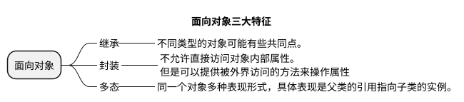
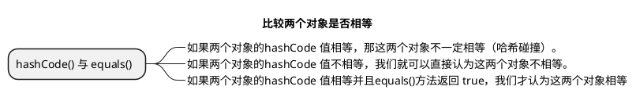
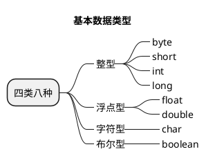
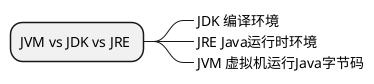
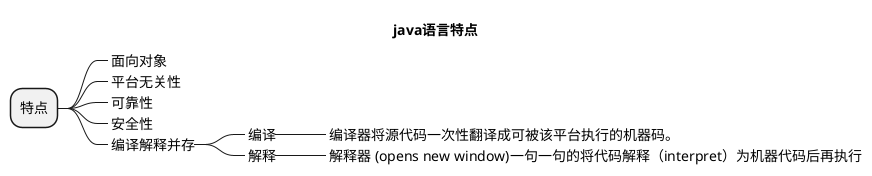

#### 字符串常量和字符型常量区别

|  | 形式上 | 内存占用 | 含义 |
|--|--|--|--|
| 字符串 | 双引号 | 若干字节 | 代表内存地址 |
| 字符型 | 单引号 | 2个字节 | 相当于一个整型(ASCII码)可参与表达式计算 |

#### continue、break和return区别

|  | 作用 |
|--|--|
| continue | 停止当前循环 |
| break | 跳出循环 |
| return | 结束方法 |

#### ==和equels区别

|  | == | equels | equels(重写Object) |
|--|--|--|--|
| 基础数据类型 | 值是否相等 | × | × |
| 引用类型 | 对象内存地址是否相等 | 类似== | 对象值是否相等 |

#### 基本数据类型默认值和空间占用

| 基本类型 | 位 | 字节 | 默认值 |取值范围 |
|--|--|--|--|--|
|byte| 8 | 1 | 0 | 2^-8 ~ 2^8 -1 |
|short| 16 | 2 | 0 | 2^-16 ~ 2^16 -1 |
|int| 32 | 4 | 0 | 2^-32 ~ 2^32 -1 |
|long| 64 | 8 | 0L | 2^-64 ~ 2^64 -1 |
|char| 16 | 2 | 'u0000' | 0-65535 |
|float| 32 | 4 | 0f | 1.4E-45 ~ 3.4028235E38 |
|double| 64 | 8 | 0d | 4.9E-324 ~ 1.7976931348623157E308 |
|boolean| 1 |  | false | ture、false |

#### String StringBuffer 和 StringBuilder 的区别是什么?

|  | 可变性 | 线程安全性 | 使用 |
|--|--|--|--|
| String | × | √ | 少量数据 |
| StringBuilder | √ | × | 字符串大量数据(单线程) |
| StringBuffer | √ | √ | 字符串大量数据(多线程) |

String 的不可变性   底层是final修饰的数组，且没有公开对数组的修改
String  str = "a";      字符串常量池中直接构建对象 
String  str = new String("a");     堆上一个，常量池一个
String.intern();      放到常量池

