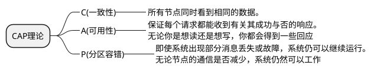
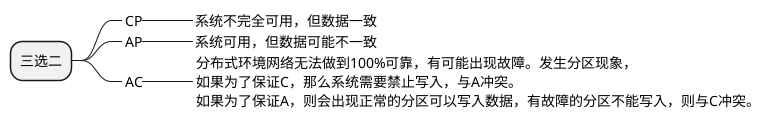

#### BASE理论

BASE理论本质上是对CAP理论的延展和补充，CAP中的AP方案的一个补充。
如果节点网络正常，即不出现分区，则我们可以考虑同时去保证A和C
如系统发生分区，我们要考虑选择CP还是AP。
**AP方案只是在系统发生分区时候放弃一致性，而不是永远放弃一致性，在分区故障恢复后，系统应该达到最终一致性。这里就是BASE理论延展的地方**

##### 三要素

##### 基本可用(Basucally Available)

基本可用是指分布式系统再出现不可预知的故障的时候，\n允许损失部分可用性，但是，这决不等价于系统不可用

**损失部分可用性**

- 响应时间上的允许
- 系统功能上的缺失

##### 软状态
允许数据存在中间状态并认为该中间状态存在不会影响系统的整体可用性，数据副本之间同步数据的过程存在延迟

##### 最终一致性
在经过一段时间之后，最终能够达到一个一致的状态

**分布式一致性的3种级别**

1. **强一致性**：系统写入了什么，读出来的就是什么。
2. **弱一致性**：不一定可以读取到最新写入的值，也不保证多少时间之后读取到的数据是最新的，只是会尽量保证某个时刻达到数据一致的状态。
3. **最终一致性**：弱一致性的升级版，系统会保证在一定时间内达到数据一致的状态。

#### 那实现最终一致性的具体方式是什么呢?

- **读时修复** : 在读取数据时，检测数据的不一致，进行修复。比如 Cassandra 的 Read Repair 实现，具体来说，在向 Cassandra 系统查询数据的时候，如果检测到不同节点 的副本数据不一致，系统就自动修复数据。
- **写时修复** : 在写入数据，检测数据的不一致时，进行修复。比如 Cassandra 的 Hinted Handoff 实现。具体来说，Cassandra 集群的节点之间远程写数据的时候，如果写失败 就将数据缓存下来，然后定时重传，修复数据的不一致性。
- **异步修复** : 这个是最常用的方式，通过定时对账检测副本数据的一致性，并修复。