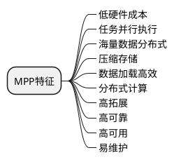
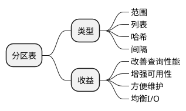
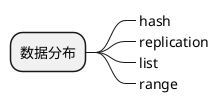
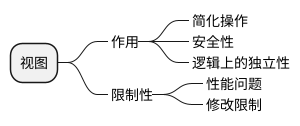
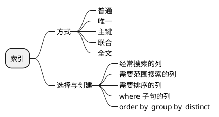
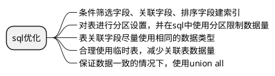
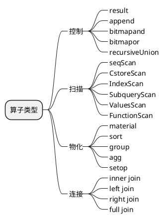

GAUSSDB(DWS)
MPP架构，分布式数据库

MPP 大规模并行处理系统，系统由许多松耦合对立单元组成，是一款Share Nothing 架构的分布式并行数据库集群

```plantuml
@startmindmap
* MPP特征
**_ 低硬件成本
**_ 任务并行执行
**_ 海量数据分布式
**_ 压缩存储
**_ 数据加载高效
**_ 分布式计算
**_ 高拓展
**_ 高可靠
**_ 高可用
**_ 易维护

@endmindmap
```

OLAP 联机分析处理  --- 复杂查询、分析数据
OLTP 联机事务处理  --- 高并发、大吞吐交易类

```plantuml
@startmindmap
* 分区表
** 类型
***_ 范围
***_ 列表
***_ 哈希
***_ 间隔
** 收益
***_ 改善查询性能
***_ 增强可用性
***_ 方便维护
***_ 均衡I/O

@endmindmap
```

```plantuml
@startmindmap
* 数据分布
**_ hash
**_ replication
**_ list
**_ range
@endmindmap
```

```plantuml
@startmindmap
* 分布列的选择
**_ 保证数据均匀分布
**_ 尽量选择关联字段
**_ 尽量选择聚合字段
@endmindmap
```

```plantuml
@startmindmap
* 视图
**_ 作用
***_ 简化操作
***_ 安全性
***_ 逻辑上的独立性
**_ 限制性
***_ 性能问题
***_ 修改限制
@endmindmap
```

```plantuml
@startmindmap
* 索引
**_ 方式
***_ 普通
***_ 唯一
***_ 主键
***_ 联合
***_ 全文
**_ 选择与创建
***_ 经常搜索的列
***_ 需要范围搜索的列
***_ 需要排序的列
***_ where 子句的列
***_ order by  group by  distinct  

@endmindmap
```

```plantuml
@startmindmap
* 行列存储比较
**_ 行
***_ 每行的所有属性存储到一起
***_ 适合查询一行的所有数据
***_ insert update 效率高
***_ 默认方式
**_ 列
***_ 每列的多个记录存储到一起
***_ 适用于海量数据查询减少磁盘访问数据量，投影高效
***_ insert update 麻烦

@endmindmap
```

如何查看查询计划
explain

```plantuml
@startmindmap
* sql优化
**_ 条件筛选字段、关联字段、排序字段建索引
**_ 对表进行分区设置，并在sql中使用分区限制数据量
**_ 表关联字段尽量使用相同的数据类型
**_ 合理使用临时表，减少关联表数据量
**_ 保证数据一致的情况下，使用union all
@endmindmap
```

```plantuml
@startmindmap
* 算子类型
**_ 控制
***_ result
***_ append
***_ bitmapand
***_ bitmapor
***_ recursiveUnion
**_ 扫描
***_ seqScan
***_ CstoreScan
***_ IndexScan
***_ SubqueryScan
***_ ValuesScan
***_ FunctionScan
**_ 物化
***_ material
***_ sort
***_ group
***_ agg
***_ setop
**_ 连接
***_ inner join
***_ left join
***_ right join
***_ full join
@endmindmap
```

