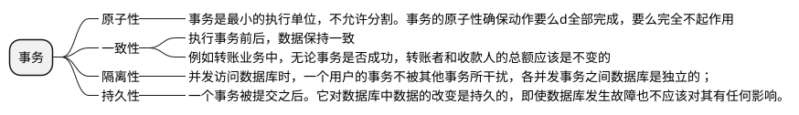
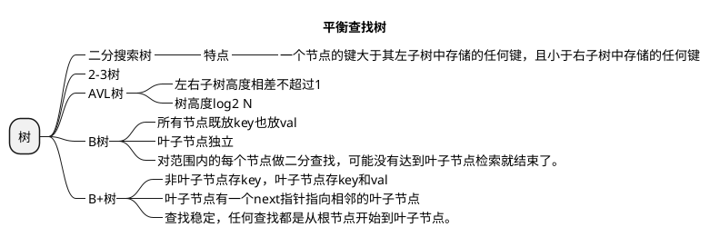
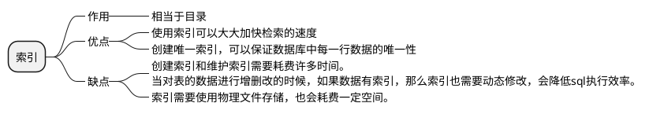
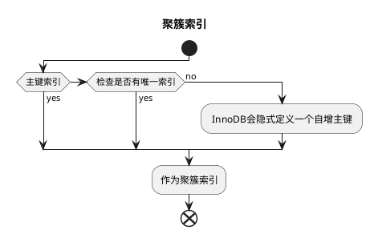
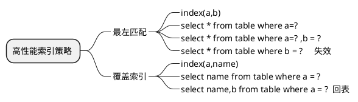
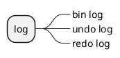

```plantuml
@startmindmap
* 事务
**_ 原子性
***_ 事务是最小的执行单位，不允许分割。事务的原子性确保动作要么d全部完成，要么完全不起作用
**_ 一致性
***_  执行事务前后，数据保持一致
***_  例如转账业务中，无论事务是否成功，转账者和收款人的总额应该是不变的
**_ 隔离性
***_  并发访问数据库时，一个用户的事务不被其他事务所干扰，各并发事务之间数据库是独立的；
**_ 持久性
***_  一个事务被提交之后。它对数据库中数据的改变是持久的，即使数据库发生故障也不应该对其有任何影响。
@endmindmap
```

```plantuml
@startmindmap
* 隔离级别
**_ 未提交读
***_ 允许读取未提交的数据更变，
***_ 脏读、不可重复读、幻读
**_ 提交读
***_ 允许读取并发事务已经提交的数据，可以阻止脏读，但幻读和不可重复读仍可能发生
***_ 不可重复读、幻读
**_ 可重复读
***_ 对同一字段多次读取的结果是一致的，除非数据被事务自己所修改
***_ 幻读
**_ 串行化
***_ 最高隔离级别，完全服从ACID的隔离级别，所有事务依次逐个执行，这样事务之间完全不可能产生干扰，也就是说，该级别可以防止脏读，不可重复读和幻读。
@endmindmap
```

```plantuml
@startmindmap
* 数据事务的实现原理
** innoDB引擎
***_ redo_log(重做日志)保证事务的持久性
***_ undo_log(回滚日志)保证事务的原子性
***_ 锁机制、MVCC保证事务的隔离性(默认支持的隔离级别是 REPEATABLE-READ)
**_ 保证了持久性，原子性，隔离性之后一致性才能得到保障
@endmindmap
```

```plantuml
@startmindmap
title 平衡查找树

* 树
**_ 二分搜索树 
***_ 特点 
****_ 一个节点的键大于其左子树中存储的任何键，且小于右子树中存储的任何键

**_ 2-3树 
**_ AVL树 
***_ 左右子树高度相差不超过1 
***_ 树高度log2 N 
**_ B树
***_ 所有节点既放key也放val
***_ 叶子节点独立
***_ 对范围内的每个节点做二分查找，可能没有达到叶子节点检索就结束了。
**_ B+树
***_ 非叶子节点存key，叶子节点存key和val
***_ 叶子节点有一个next指针指向相邻的叶子节点
***_ 查找稳定，任何查找都是从根节点开始到叶子节点。


@endmindmap
```

```plantuml
@startmindmap
* 索引
**_ 作用
***_ 相当于目录
**_ 优点
***_ 使用索引可以大大加快检索的速度
***_ 创建唯一索引，可以保证数据库中每一行数据的唯一性
**_ 缺点
***_:创建索引和维护索引需要耗费许多时间。
当对表的数据进行增删改的时候，如果数据有索引，那么索引也需要动态修改，会降低sql执行效率。;
***_ 索引需要使用物理文件存储，也会耗费一定空间。


@endmindmap
```

```plantuml
@startmindmap
* 索引类型
**_ 主键索引
***_ 一个表只能有一个主键，且主键不能为NULL，不能重复
**_ 二级索引(辅助索引)
***_ 特点
****_ 叶子节点 Val 存主键值。
***_ 唯一索引
****_ 属性列数据不能重复，允许 NULL ，一张表允许创建多个唯一索引
****_ 建立唯一索引的目的是该属性列的唯一性，而不是为了提高效率
***_ 普通索引
****_ 一张表允许创建多个普通索引，并允许数据重复和 NULL。
****_ 普通索引的唯一作用就是为了快速查询数据，
***_ 前缀索引
****_ 前缀索引只适用于字符串类型的数据。
****_ 前缀索引是对文本的前几个字符创建索引，相比普通索引建立的数据更小， 因为只取前几个字符。

***_ 全文索引
****_ 全文索引主要是为了检索大文本数据中的关键字的信息，是目前搜索引擎数据库使用的一种技术

@endmindmap
```

```plantuml
@startuml
title 聚簇索引
start
if (主键索引) then(yes)

else if (检查是否有唯一索引) then(yes)
else (no)
   : InnoDB会隐式定义一个自增主键 ;
endif
:作为聚簇索引;
end
@enduml
```

```plantuml
@startmindmap
* 聚簇索引和非聚簇索引
**_ 聚簇索引
***_ 特点
****_ 索引结构和数据一起存放的索引。主键索引属于聚簇索引
***_ 物理存放
****_:在MySql中InnoDB引擎的表的 .idb 文件就包含了该表的索引和数据
对于InnoDB引擎来说，该表的索引(B+树)的每个非叶子节点存储索引，叶子节点存储索引和索引对应的数据;
***_ 优点
****_ 聚集索引的查询数据非常快，因为整个B+树本身就是一颗多叉平衡树，叶子节点也都是有序的，定位到索引的节点，就相当于定位到了数据。
***_ 缺点
****_ 依赖于有序的数据 
****_ 更新代价大 

**_ 非聚簇索引
***_ 特点
****_ 非聚集索引即索引结构和数据分开存放的索引。
***_ 物理存放
***_ 优点
****_ 更新代价比聚集索引要小 
***_ 缺点
****_ 跟聚集索引一样，非聚集索引也依赖于有序的数据
****_ 可能会二次查询(回表)

@endmindmap
```

```plantuml
@startmindmap
* 高性能索引策略 
**_ 最左匹配 
***_ index(a,b)
***_ select * from table where a=?  
***_ select * from table where a=? ,b = ?    
***_ select * from table where b = ?     失效 

**_ 覆盖索引 
***_ index(a,name)
***_ select name from table where a = ? 
***_ select name,b from table where a = ?  回表 

@endmindmap
```

```plantuml
@startmindmap
* 存储引擎索引区别 

@endmindmap
```

```plantuml
@startmindmap
* MVCC
@endmindmap
```

```plantuml
@startmindmap
* log
**_ bin log
**_ undo log
**_ redo log
@endmindmap
```

#### 
