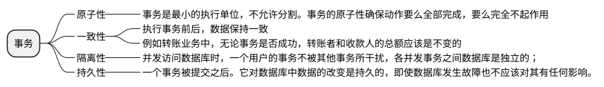

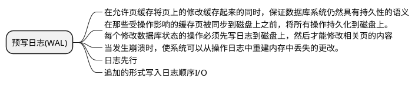

#### 各隔离级别下，并发事务问题对应

|  | 脏读 | 不可重复读 | 幻读 |
|--|--|--|--|
| 未提交读 | √ | √ | √ |
| 提交读 | x | √ | √ |
| 可重复读 | x | x | √ |
| 串行化 | x | x | x |

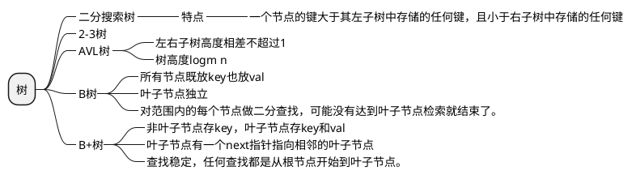

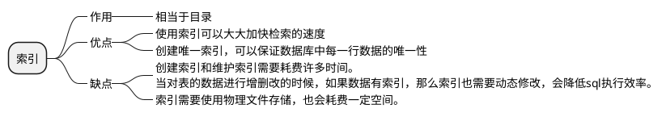

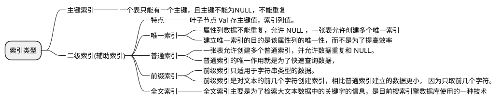

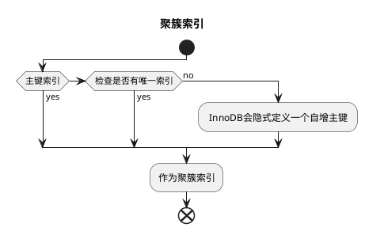

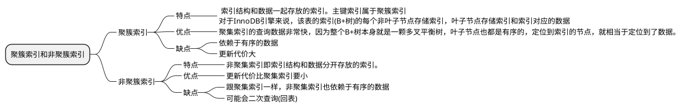

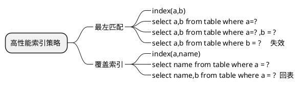

#### 存储引擎索引区别 

|  | 锁 | 事务 | 外键 | 崩溃后恢复 |MVCC(行锁升级)|
|--|--|--|--|--|--|
| InnoDB | 行锁(默认)、表锁 | √ | √ | √ | √ | √ |
| MyISAM | 表锁 | x | x | x | x | x |

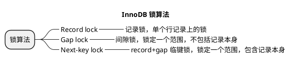

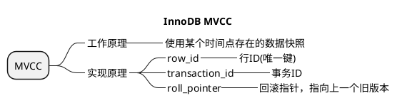

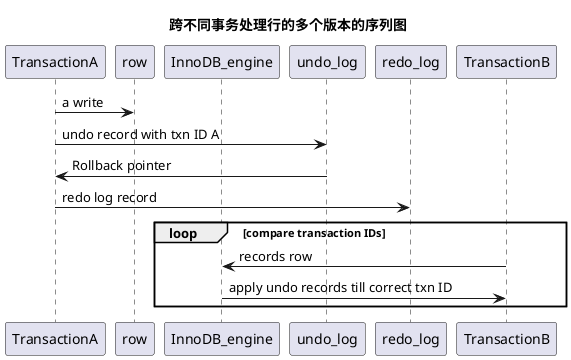

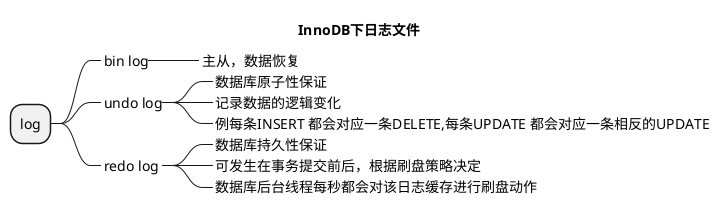

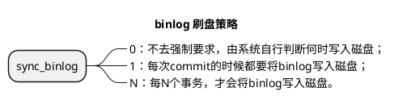

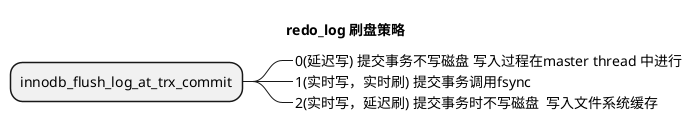

<!-- @import "../image/06.png" -->
<!-- @import "../image/07.png" -->
<!-- @import "../image/09.png" -->

#### 参考
[高性能mysql第三版](C:\Users\yy\Desktop\资料\mysql\高性能mysql第三版.pdf)
[高性能mysql第四版](C:\Users\yy\Desktop\资料\mysql\高性能mysql第三版.pdf)
[MySQL是怎样运行的：从根儿上理解MySQL](C:\Users\yy\Desktop\资料\mysql\MySQL是怎样运行的：从根儿上理解MySQL.pdf)
[数据库系统内幕.pdf](C:\Users\yy\Desktop\资料\mysql\数据库系统内幕.pdf)