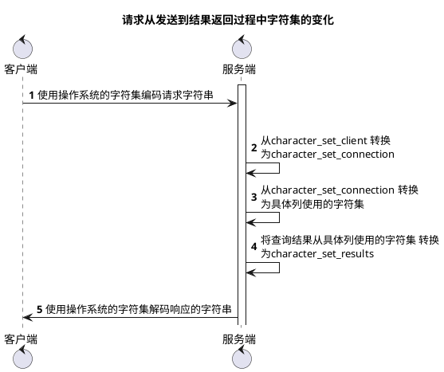

```mysql
#查看mysql字符集
show variables '%character%'
```

```outprint
+--------------------------+--------------------------------+
| Variable_name            | Value                          |
+--------------------------+--------------------------------+
| character_set_client     | utf8mb4                        |           服务端解码请求时使用的字符集
| character_set_connection | utf8mb4                        |           服务端处理请求时会把请求的字符串从 character_set_client  转换为   character_set_connection
| character_set_database   | utf8mb4                        |
| character_set_filesystem | binary                         |
| character_set_results    | utf8mb4                        |           服务端向客户端返回时使用的字符集
| character_set_server     | utf8mb4                        |
| character_set_system     | utf8mb3                        |
| character_sets_dir       | /usr/share/mysql-8.0/charsets/ |
+--------------------------+--------------------------------+
```




### sql优化

```mysql
create table t1(m1 int,n1 char(1));
create table t1(m2 int,n2 char(1));

INSERT INTO t1 VALUES(1, 'a'), (2, 'b'), (3, 'c');
INSERT INTO t2 VALUES(2, 'b'), (3, 'c'), (4, 'd');
```

```outprint
SELECT * FROM t1;
+------+------+
| m1 | n1 |
+------+------+
| 1 | a |
| 2 | b |
| 3 | c |
+------+------+

SELECT * FROM t2;
+------+------+
| m2 | n2 |
+------+------+
| 2 | b |
| 3 | c |
| 4 | d |
+------+------+

```

#### 小表驱动大表

1. 内连接
select * from t1,t2 where t1 > 1 and t1.m1=t2.m2 and t2.n2<'d'

- 驱动表的记录在被驱动表中找不到匹配的记录，该记录不会加入到最后的结果集中。

- 第一个查询的表称为驱动表,驱动表只需要访问一次。

- 被驱动表可能被访问多次。

2. 外连接

- 对于t1 left join t2 来说  驱动表为t1  
- 对于t1 right join t2 来说  驱动表为t2  
- 驱动表的记录在被驱动表中找不到匹配的记录，该记录也会加入到最后的结果集中。


#### 参考
- 《MySQL是怎样运行的：从根儿上理解MySQL》