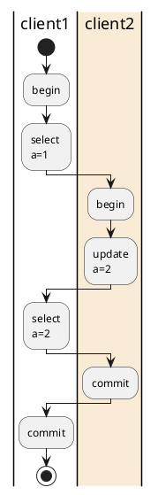
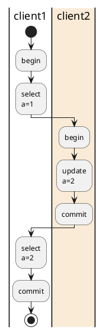
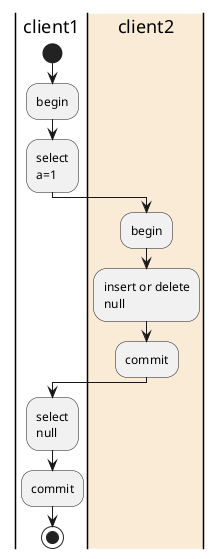

#### 事务是否自动提交

```mysql
//查看
show variables like 'autocommit';

//不自动提交
set autocommit = 0;  

//自动提交
set autocommit = 1;  

```

#### 隔离级别

```mysql 
show variables like 'transaction_isolation';

SET GLOBAL TRANSACTION ISOLATION LEVEL $(level);

level: {
     REPEATABLE READ                    //可重复读
   | READ COMMITTED                     //读提交
   | READ UNCOMMITTED                   //读未提交
   | SERIALIZABLE                       //序列化
}

```

#### 前置

```mysql
CREATE TABLE `single_table` (
  `id` int NOT NULL AUTO_INCREMENT,
  `key1` varchar(100) DEFAULT NULL,
  `key2` int DEFAULT NULL,
  `key3` varchar(100) DEFAULT NULL,
  `key_part1` varchar(100) DEFAULT NULL,
  `key_part2` varchar(100) DEFAULT NULL,
  `key_part3` varchar(100) DEFAULT NULL,
  `common_field` varchar(100) DEFAULT NULL,
  PRIMARY KEY (`id`),
  UNIQUE KEY `idx_key2` (`key2`),
  KEY `idx_key1` (`key1`),
  KEY `idx_key3` (`key3`),
  KEY `idx_key_part` (`key_part1`,`key_part2`,`key_part3`)
)

INSERT INTO `single_table` (`id`, `key1`, `key2`, `key3`, `key_part1`, `key_part2`, `key_part3`, `common_field`) VALUES (1, 'aaa', 2, 'lisi', NULL, NULL, NULL, NULL);

INSERT INTO `single_table` (`id`, `key1`, `key2`, `key3`, `key_part1`, `key_part2`, `key_part3`, `common_field`) VALUES (2, 'bbb', 3, 'wangwu', NULL, NULL, NULL, NULL);


```

#### 脏读

```mysql
SET GLOBAL TRANSACTION ISOLATION LEVEL READ UNCOMMITTED;
set autocommit = 0; 
```

```mysql
client 1 

begin;
select * from single_table;


select * from single_table;


```

```mysql
client 2 

begin;

update single_table set key1 = 'mmm' where id = 1;

```



#### 不可重复读

```mysql
SET GLOBAL TRANSACTION ISOLATION LEVEL READ COMMITTED;
set autocommit = 0; 
```

```mysql
client 1 

begin;
select * from single_table;


select * from single_table;


```

```mysql
client 2 

begin;

update single_table set key1 = 'ppp' where id = 1;

commit;

```



#### 幻读

```mysql
SET GLOBAL TRANSACTION ISOLATION LEVEL READ COMMITTED;
set autocommit = 0; 
```

```mysql
client 1 

begin;
select * from single_table;


select * from single_table;


```

```mysql
client 2 

begin;

INSERT INTO `single_table` (`id`, `key1`, `key2`, `key3`, `key_part1`, `key_part2`, `key_part3`, `common_field`) VALUES (3, 'lll', 3, 'zhangfei', NULL, NULL, NULL, NULL);

delete from table where = ?; 

commit;

```



#### 参考
[autocommit 参数设置](https://dev.mysql.com/doc/refman/8.0/en/innodb-autocommit-commit-rollback.html)
[Transaction Isolation Levels](https://dev.mysql.com/doc/refman/8.0/en/innodb-transaction-isolation-levels.html)
[SET TRANSACTION Statement](https://dev.mysql.com/doc/refman/8.0/en/set-transaction.html)