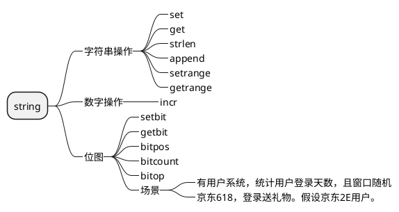
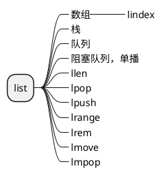
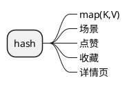
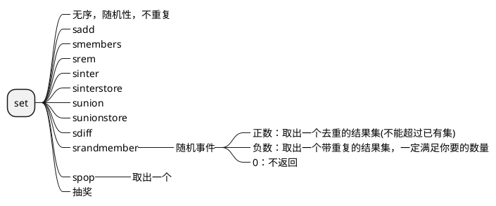
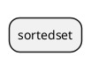

type key

object encoding key

```plantuml
@startmindmap
* string
**_ 字符串操作
***_ set 
***_ get  
***_ strlen  
***_ append  
***_ setrange  
***_ getrange  
**_ 数字操作
***_ incr
**_ 位图
***_ setbit
***_ getbit
***_ bitpos
***_ bitcount
***_ bitop
***_ 场景
****_ 有用户系统，统计用户登录天数，且窗口随机
****_ 京东618，登录送礼物。假设京东2E用户。
@endmindmap
```

```plantuml
@startmindmap
* list
**_ 数组
***_ lindex
**_ 栈
**_ 队列
**_ 阻塞队列，单播
**_ llen
**_ lpop
**_ lpush
**_ lrange
**_ lrem
**_ lmove
**_ lmpop
@endmindmap
```

```plantuml
@startmindmap
* hash
**_ map(K,V)
**_ 场景
**_ 点赞
**_ 收藏
**_ 详情页
@endmindmap
```

```plantuml
@startmindmap
* set
**_ 无序，随机性，不重复
**_ sadd
**_ smembers
**_ srem
**_ sinter
**_ sinterstore
**_ sunion
**_ sunionstore
**_ sdiff
**_ srandmember
***_ 随机事件
****_ 正数：取出一个去重的结果集(不能超过已有集)
****_ 负数：取出一个带重复的结果集，一定满足你要的数量
****_ 0：不返回
**_ spop
***_ 取出一个
**_ 抽奖
@endmindmap
```

```plantuml
@startmindmap
* sortedset
@endmindmap
```

#### 参考

[redis官网](https://redis.io/)
[redis中文网](http://www.redis.cn/)
[redis value的5中类型](https://www.cnblogs.com/yhq1314/p/10000971.html)