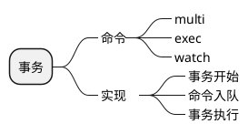

<!-- @import "./image/事务_1.png" -->

1. 事务提供了一种将多个命令打包，然后一次性、有序的执行的机制
2. 多个命令会被入队到一个队列中去，然后按先进先出顺序执行
事务在执行过程中不会中断，当事务队列中的命令执行完之后，事务才会结束
3. 带有watch命令的事务会将客户端和被监视的键在数据库的watched_keys字典中进行关联，当键被修改时，程序会将所有监视被修改的客户端的redis_dirty_cas标志打开
4. 只有客户端的redis_dirty_cas标志未被打开时，服务器才会执行客户端提交的事务，否则的话，服务器将拒绝执行客户端提交的事务
5. redis的事务总是具有ACID中的原子性、隔离性、持久性，当服务器运行在AOF持久化模式下，并且appendfsync选项值为always时，事务也具有持久性。

