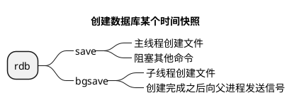

```c
struct redisServer{
    //
    //一个数组，保存着数据库服务器中的所有数据库
    redisDb *db;
    //服务器的数据库数量
    int dbnum;
    //自动间隔性保存 保存条件
    struct saveparam saveparams;

}redisServer;
```

```c
struct redisDb{
    // 数据库键空间，保存着数据库中的所有键值对
    dict *dict;
    // 过期字典，保存着键的过期时间
    dict *expires;
}redisDb;
```

<!-- @import "./image/redisDb_2.png" -->


<!-- @import "./data_structure/过期键的删除策略.puml" -->

### 持久化策略

#### RDB




```c
struct redisServer{
    //自动保存条件
    struct saveparam saveparams;

    //计数器
    long long dirty;
    //上一次执行保存的时间
    time_t lastsave;
}redisServer;

struct saveparam{
    //秒数
    time_t seconds;
    //修改数
    int changes;
}saveparam;
```

保存条件
save 300 1 

300 秒  修改 1 次 即bgsave 生成rdb


#### AOF
