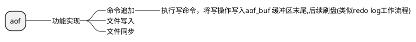

```c
struct redisServer{
    //
    //一个数组，保存着数据库服务器中的所有数据库
    redisDb *db;
    //服务器的数据库数量
    int dbnum;
    //自动间隔性保存 保存条件
    struct saveparam saveparams;

}redisServer;
```

```c
struct redisDb{
    // 数据库键空间，保存着数据库中的所有键值对
    dict *dict;
    // 过期字典，保存着键的过期时间
    dict *expires;
}redisDb;
```

<!-- @import "./image/redisDb_2.png" -->


<!-- @import "./data_structure/过期键的删除策略.puml" -->

### 持久化策略

#### RDB


```c
struct redisServer{
    //自动保存条件
    struct saveparam saveparams;

    //计数器
    long long dirty;
    //上一次执行保存的时间
    time_t lastsave;
}redisServer;

struct saveparam{
    //秒数
    time_t seconds;
    //修改数
    int changes;
}saveparam;
```

保存条件
save 300 1 

300 秒  修改 1 次 即bgsave 生成rdb


#### AOF
```c
struct redisServer{
    //aop缓冲区
    sds aof_buf;
}redisServer;
```



##### 重写aof文件 

重写文件aof文件，多条写操作合并为一条
bgrewriteraof
例: list (a,b,c)
lrange list 0 -1
rpush list "a" "b" "c"    

再执行重写aof文件时，为了不阻塞主服务器的线程，采取子进程方式进行，而非子线程(线程可共享进程的主存)。
新的问题。子进程，和主进程。数据不一致问题。

<!-- @import "./image/aof重写_1.png" -->


#### redis client
```c
struct redisServer{
    //一个链表，保存了所有客户端状态
    list *clients*;
}redisServer;


typedef struct redisClient{
    // fd = -1 为lua脚本或者aof文件
    // fd > 0 普通客户端
    in fd;

    //客户端名称
    robj *name;
    //标志，记录客户端的角色，以及客户端目前所处的状态
    int flags;
    //输入缓冲区
    sds querybuf;

    //命令与参数
    robj *argv;
    int argc;

    // argv[0] 对应 redisCommand
    struct redisCommand *cmd;

    //输出缓冲区 buf 16kb     bufpos  可变大小
    char buf[redis_chunk_bytes];
    int bufpos;

    //身份认证
    int auth;

    //时间
    time_t ctime;
    time_t lastinteraction;
    time_t obuf_soft_limit_reached_time;
}redisClient;
```

<!-- @import "./image/client_1.png" -->
<!-- @import "./image/client_2.png" -->
<!-- @import "./image/client_3.png" -->


