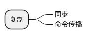
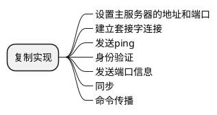
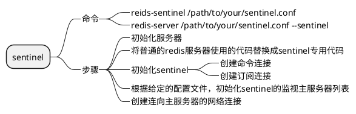

slaveof ip port 

#### sync

1. 从服务器发送sync
2. 主服务器执行bgsave，生成rdb文件，并用一个缓冲区记录从现在开始执行的所有写命令
3. 从服务器载入rdb
4. 主服务器发送缓冲区内容至从服务器，从而达到同步

<!-- @import "./image/复制_1.png" -->


<!-- @import "./image/复制_2.png" -->
<!-- @import "./image/复制_3.png" -->
<!-- @import "./image/复制_4.png" -->

#### psync

<!-- @import "./image/复制_5.png" -->


```c
struct redisServer{

    //主服务器的地址
    char *masterhost;
    //主服务器的端口
    int mastport;

}redisServer;
```




例
```c
min-slaves-to-write   3
min-slaves-max-lag    10
```
从服务器小于3，或者3个从服务器的延迟值都大于或等于10秒时，那么主服务器会拒绝执行写命令


##### 检测命令丢失
<!-- @import "./image/复制_6.png" -->


#### sentinel

<!-- @import "./image/sentinel_1.png" -->




<!-- @import "./image/sentinel_2.png" -->

##### 主观检测下线
sentinel 向监听的服务器发送ping 
```c
sentinelA
sentinel monitor master 127.0.0.1 6379 2
sentinel down-after-millisecords master 50000

sentinelB
sentinel monitor master 127.0.0.1 6379 2
sentinel down-after-millisecords master 10000
```

##### 客观检测下线
当一个sentinel将一个主服务器判断主观下线之后，为了确认主服务器是否已经正在下线，它会向同样监视这主服务器的其他sentinel 进行询问

源sentinel    向目标sentinel发送
发送 sentinel is-marster-down-by-addr
接收 sentinel is-marster-down-by-addr
接收 sentinel is-marster-down-by-addr 回复


sentinel is-marster-down-by-addr 作用
一是确认下线判定，二是进行领导者选举。

##### sentinel选举领头
发送者作为选举者                   接受消息者作为投票者
所有认定主服务器客观下线的sentinel  都可作为选举者


投过票的不能再投票
票数超过sentinel 数量的一半会胜出，作为领头的sentinel


##### 设置新的master 服务器
1. 选出新的主服务器
2. 修改从服务器的复制目标
3. 将旧的主服务器变为从服务器


#### 参考
[redis设计与实现](C:/Users/y'y/Desktop/%E8%B5%84%E6%96%99/redis/Redis%E8%AE%BE%E8%AE%A1%E4%B8%8E%E5%AE%9E%E7%8E%B0.pdf)

