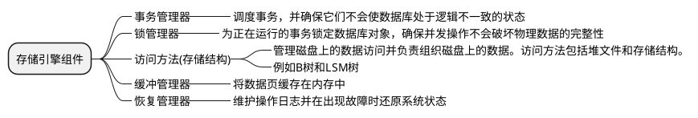
```plantuml
@startmindmap
* 存储引擎组件
**_ 事务管理器
***_ 调度事务，并确保它们不会使数据库处于逻辑不一致的状态

**_ 锁管理器
***_ 为正在运行的事务锁定数据库对象，确保并发操作不会破坏物理数据的完整性

**_ 访问方法(存储结构)
***_ 管理磁盘上的数据访问并负责组织磁盘上的数据。访问方法包括堆文件和存储结构。
***_ 例如B树和LSM树

**_ 缓冲管理器
***_ 将数据页缓存在内存中

**_ 恢复管理器
***_ 维护操作日志并在出现故障时还原系统状态

@endmindmap
```

```plantuml
@startmindmap
* 数据库文件
**_ 数据文件
***_ 数据文件存储数据文件
**_ 索引文件
***_ 存储元数据用来定位数据文件中的记录
**_:文件被划分为页，每个页通常具有单个或多个磁盘块的大小
页可以被组织成记录的序列或者分槽页;

@endmindmap
```

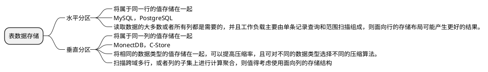
```plantuml
@startmindmap
* 表数据存储
**_ 水平分区
***_ 将属于同一行的值存储在一起
***_ MySQL，PostgreSQL
***_ 读取数据的大多数或者所有列都是需要的，并且工作负载主要由单条记录查询和范围扫描组成，则面向行的存储布局可能产生更好的结果。
**_ 垂直分区
***_ 将属于同一列的值存储在一起
***_ MonectDB，C-Store
***_ 将相同的数据类型的值存储在一起，可以提高压缩率，且可对不同的数据类型选择不同的压缩算法。
***_ 扫描跨域多行，或者列的子集上进行计算聚合，则值得考虑使用面向列的存储结构


@endmindmap
```

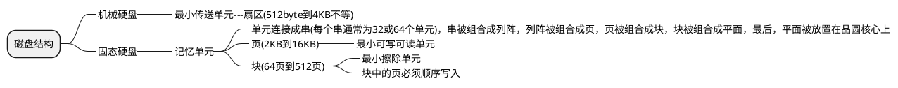
```plantuml
@startmindmap
* 磁盘结构
**_ 机械硬盘
***_ 最小传送单元---扇区(512byte到4KB不等)
**_ 固态硬盘
***_ 记忆单元
****_ 单元连接成串(每个串通常为32或64个单元)，串被组合成列阵，列阵被组合成页，页被组合成块，块被组合成平面，最后，平面被放置在晶圆核心上
****_ 页(2KB到16KB)
*****_ 最小可写可读单元
****_ 块(64页到512页)
*****_ 最小擦除单元
*****_ 块中的页必须顺序写入

@endmindmap
```

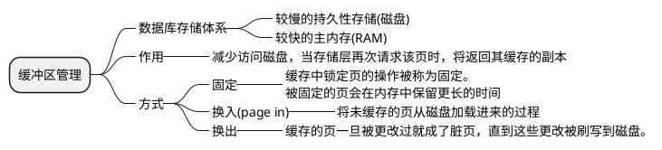
```plantuml
@startmindmap
* 缓冲区管理
**_ 数据库存储体系
***_ 较慢的持久性存储(磁盘)
***_ 较快的主内存(RAM)

**_ 作用
***_ 减少访问磁盘，当存储层再次请求该页时，将返回其缓存的副本

**_ 方式
***_ 固定
****_ 缓存中锁定页的操作被称为固定。\n被固定的页会在内存中保留更长的时间
***_ 换入(page in)
****_ 将未缓存的页从磁盘加载进来的过程
***_ 换出
****_ 缓存的页一旦被更改过就成了脏页，直到这些更改被刷写到磁盘。

@endmindmap
```

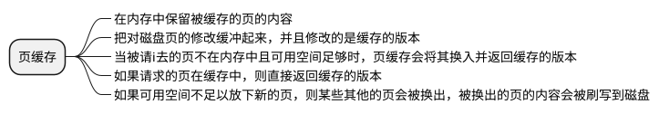
```plantuml
@startmindmap
* 页缓存
**_ 在内存中保留被缓存的页的内容
**_ 把对磁盘页的修改缓冲起来，并且修改的是缓存的版本
**_ 当被请i去的页不在内存中且可用空间足够时，页缓存会将其换入并返回缓存的版本
**_ 如果请求的页在缓存中，则直接返回缓存的版本
**_ 如果可用空间不足以放下新的页，则某些其他的页会被换出，被换出的页的内容会被刷写到磁盘
@endmindmap
```

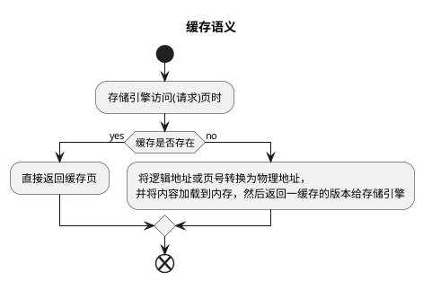
```plantuml
@startuml
title 缓存语义
start
: 存储引擎访问(请求)页时 ;
if (缓存是否存在) then (yes)
 : 直接返回缓存页 ;
else (no) 
 : 将逻辑地址或页号转换为物理地址，\n并将内容加载到内存，然后返回一缓存的版本给存储引擎;
endif
end

@enduml
```

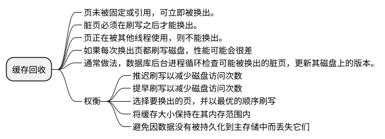
```plantuml
@startmindmap
* 缓存回收
**_ 页未被固定或引用，可立即被换出。
**_ 脏页必须在刷写之后才能换出。
**_ 页正在被其他线程使用，则不能换出。
**_ 如果每次换出页都刷写磁盘，性能可能会很差
**_ 通常做法，数据库后台进程循环检查可能被换出的脏页，更新其磁盘上的版本。


**_ 权衡
***_ 推迟刷写以减少磁盘访问次数
***_ 提早刷写以减少磁盘访问次数
***_ 选择要换出的页，并以最优的顺序刷写
***_ 将缓存大小保持在其内存范围内
***_ 避免因数据没有被持久化到主存储中而丢失它们

@endmindmap
```

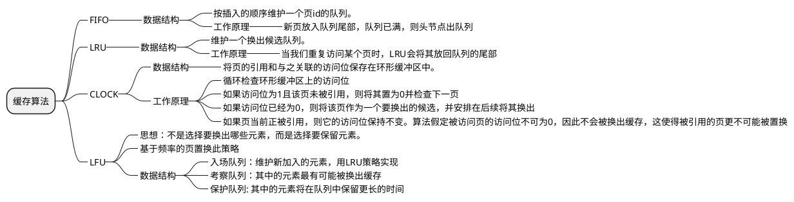
```plantuml
@startmindmap
* 缓存算法
**_ FIFO
***_ 数据结构
****_ 按插入的顺序维护一个页id的队列。
****_ 工作原理
*****_ 新页放入队列尾部，队列已满，则头节点出队列


**_ LRU
***_ 数据结构
****_ 维护一个换出候选队列。
****_ 工作原理
*****_ 当我们重复访问某个页时，LRU会将其放回队列的尾部

**_ CLOCK
***_ 数据结构
****_ 将页的引用和与之关联的访问位保存在环形缓冲区中。
***_ 工作原理
****_ 循环检查环形缓冲区上的访问位
****_ 如果访问位为1且该页未被引用，则将其置为0并检查下一页
****_ 如果访问位已经为0，则将该页作为一个要换出的候选，并安排在后续将其换出
****_ 如果页当前正被引用，则它的访问位保持不变。算法假定被访问页的访问位不可为0，因此不会被换出缓存，这使得被引用的页更不可能被置换

**_ LFU
***_ 思想：不是选择要换出哪些元素，而是选择要保留元素。
***_ 基于频率的页置换此策略
***_ 数据结构
****_ 入场队列：维护新加入的元素，用LRU策略实现
****_ 考察队列：其中的元素最有可能被换出缓存
****_ 保护队列: 其中的元素将在队列中保留更长的时间
@endmindmap
```

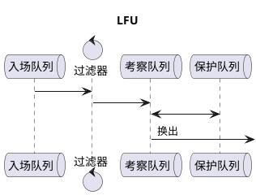
```plantuml
@startuml
title LFU
queue 入场队列 as entryQueue
control 过滤器 as filter
queue 考察队列 as visitQueue
queue 保护队列 as protectQueue

entryQueue -> filter
filter -> visitQueue
visitQueue <-> protectQueue
visitQueue ->   :换出
@enduml
```

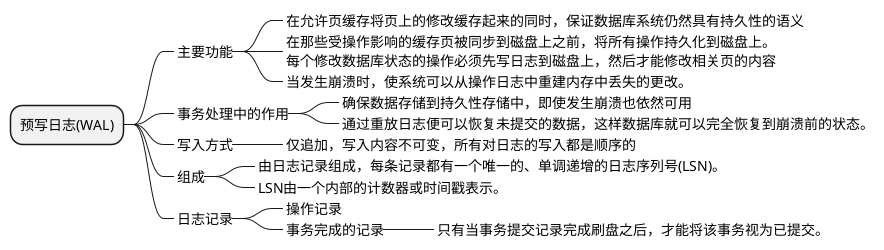
```plantuml
@startmindmap
* 预写日志(WAL)
**_ 主要功能
***_ 在允许页缓存将页上的修改缓存起来的同时，保证数据库系统仍然具有持久性的语义
***_:在那些受操作影响的缓存页被同步到磁盘上之前，将所有操作持久化到磁盘上。
每个修改数据库状态的操作必须先写日志到磁盘上，然后才能修改相关页的内容;
***_ 当发生崩溃时，使系统可以从操作日志中重建内存中丢失的更改。
**_ 事务处理中的作用
***_ 确保数据存储到持久性存储中，即使发生崩溃也依然可用
***_ 通过重放日志便可以恢复未提交的数据，这样数据库就可以完全恢复到崩溃前的状态。
**_ 写入方式
***_ 仅追加，写入内容不可变，所有对日志的写入都是顺序的
**_ 组成
***_ 由日志记录组成，每条记录都有一个唯一的、单调递增的日志序列号(LSN)。
***_ LSN由一个内部的计数器或时间戳表示。
**_ 日志记录
***_ 操作记录
***_ 事务完成的记录
****_ 只有当事务提交记录完成刷盘之后，才能将该事务视为已提交。

@endmindmap
```

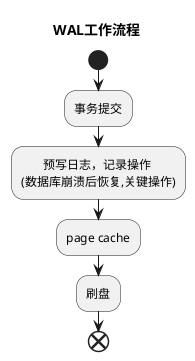
```plantuml
@startuml
title WAL工作流程
start
:事务提交;
:       预写日志，记录操作
(数据库崩溃后恢复,关键操作);
:page cache;
:刷盘;
end

@enduml
```

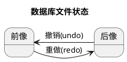
```plantuml
@startuml
title 数据库文件状态
state 前像
state 后像
前像 -> 后像 : 重做(redo)
后像 -> 前像 : 撤销(undo)

@enduml
```

```plantuml
@startmindmap
* 操作日志、数据日志
**_ 物理日志 
***_ 保存对完整页的状态或字节级的更改 
***_ 记录前像和后像 
**_ 逻辑日志 
***_ 保存在当前状态上执行的操作 
***_ 记录对页应用哪些操作。 例如: 向键Y插入数据记录X 
***_ 以及相应的撤销操作。 例如: 删除与Y关联的值  


@endmindmap
```

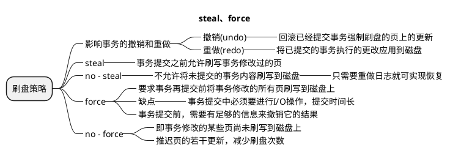
```plantuml
@startmindmap
title steal、force
* 刷盘策略
**_ 影响事务的撤销和重做
***_ 撤销(undo)
****_ 回滚已经提交事务强制刷盘的页上的更新
***_ 重做(redo)
****_ 将已提交的事务执行的更改应用到磁盘

**_ steal
***_ 事务提交之前允许刷写事务修改过的页
**_ no - steal
***_ 不允许将未提交的事务内容刷写到磁盘
****_ 只需要重做日志就可实现恢复

**_ force
***_ 要求事务再提交前将事务修改的所有页刷写到磁盘上
***_ 缺点
****_ 事务提交中必须要进行I/O操作，提交时间长
***_ 事务提交前，需要有足够的信息来撤销它的结果
**_ no - force
***_ 即事务修改的某些页尚未刷写到磁盘上
***_ 推迟页的若干更新，减少刷盘次数

@endmindmap
```

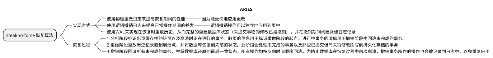
```plantuml
@startmindmap
title ARIES
* steal/no-force 恢复算法
**_ 实现方式
***_ 使用物理重做日志来提高恢复期间的性能
****_ 因为能更快地应用更改 

***_ 使用逻辑撤销日志来提高正常操作期间的并发
****_ 逻辑撤销操作可以独立地应用到页中

***_ 使用WAL来实现在恢复时重放历史，从而完整的重建数据库状态（未提交事物的修改已被撤销），并在撤销期间构建补偿日志记录


**_ 恢复过程
***_ 1.分析阶段标识出页缓存中的脏页以及崩溃时正在进行的事务。脏页的信息用于标识重做阶段的起点。进行中事务的清单用于撤销阶段中回滚未完成的事务。
***_ 2.重做阶段重放历史记录直到崩溃点，并将数据库恢复到先前的状态。此阶段会处理未完成的事务以及那些已提交但尚未将修改刷写到持久化存储的事务
***_ 3.撤销阶段回滚所有未完成的事务，并将数据库还原到最后一致状态，所有操作均按反向时间顺序回滚。为防止数据库在恢复过程中再次崩溃，撤销事务所作的操作也会被记录到日志中，以免重复应用

@endmindmap
```

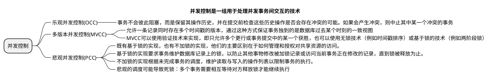
```plantuml
@startmindmap
title 并发控制是一组用于处理并发事务间交互的技术
* 并发控制
**_ 乐观并发控制(OCC)
***_ 事务不会彼此阻塞，而是保留其操作历史，并在提交前检查这些历史操作是否会存在冲突的可能。如果会产生冲突，则中止其中某一个冲突的事务

**_ 多版本并发控制(MVCC)
***_ 允许一条记录同时存在多个时间戳的版本，通过这种方式保证事务独到的是数据库过去某个时刻的一致视图
***_ MVCC可以使用验证技术来实现，即只允许多个更行或事务提交中的某一个获胜，也可以使用无锁技术（例如时间戳排序）或基于锁的技术（例如两阶段锁）

**_ 悲观并发控制(PCC)
***_ 既有基于锁的实现，也有不加锁的实现，他们的主要区别在于如何管理和授权对共享资源的访问。
***_ 基于锁的实现要求事务维护数据库记录上的锁，以防止其他事物修改被加锁记录或访问当前事务正在修改的记录，直到锁被释放为止。
***_ 不加锁的实现根据未完成事务的调度，维护读取与写入的操作列表以限制事务的执行。
***_ 悲观的调度可能导致死锁：多个事务需要相互等待对方释放锁才能继续执行

@endmindmap
```

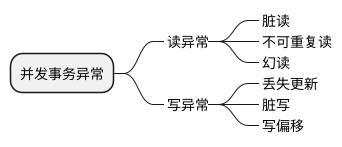
```plantuml
@startmindmap
* 并发事务异常
**_ 读异常
***_ 脏读
***_ 不可重复读
***_ 幻读
**_ 写异常
***_ 丢失更新
***_ 脏写
***_ 写偏移


@endmindmap
```

#### 参考
- 《数据库系统内幕》